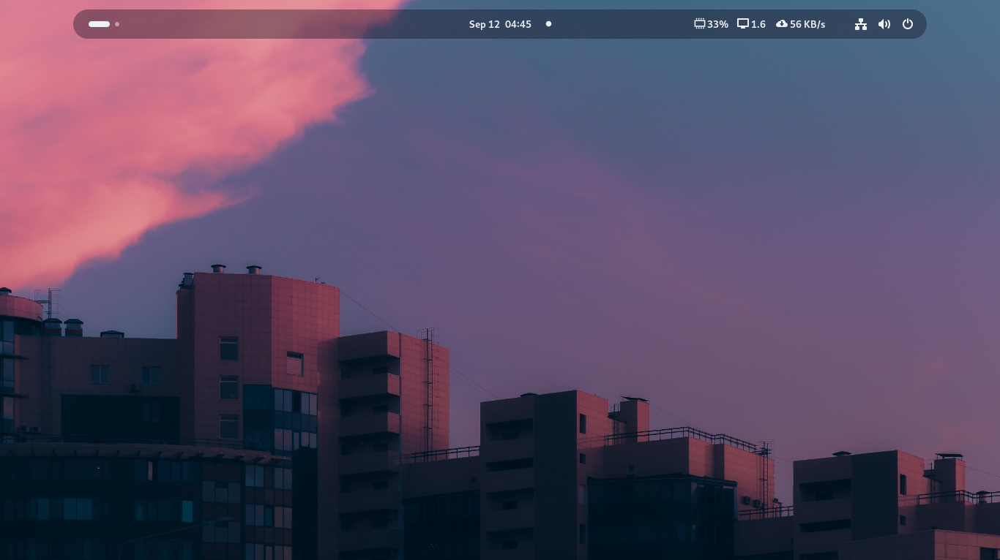

<h1 align="center">Personal GNOME Configuration</h1>

Welcome to the configuration hub for my GNOME desktop environment! This directory holds all the details about the theme, extensions, and personal tweaks that make my GNOME setup unique. If you're looking to customize your own setup or are just curious about my configuration, you're in the right place.

## Table of Contents
- [Installation](#installation)
- [Extensions](#extensions)
- [Key Changes](#key-changes)
- [Screenshots](#screenshots)
- [Resources](#resources)

## Installation

I use the [Catppuccin-GTK-Theme](https://github.com/Fausto-Korpsvart/Catppuccin-GTK-Theme) as the foundation of my theme, with a few tweaks to match my personal aesthetic. For icons, I stick with the clean and classic [Adwaita](https://gitlab.gnome.org/GNOME/gtk/-/tree/master/gtk/theme/Adwaita) icon theme.

To install my theme setup, simply run this script:

```bash
curl -fsSL https://raw.githubusercontent.com/stellaOnEstrogen/dotfiles/main/machines/personal/scripts/install_theme.sh | sudo bash
```

## Extensions

Here are the GNOME extensions that elevate my desktop experience:

- **[Just Perfection](https://extensions.gnome.org/extension/3843/just-perfection/)** — Tune your GNOME shell to perfection with customizable options.
- **[User Themes](https://extensions.gnome.org/extension/19/user-themes/)** — Easily manage and switch between GNOME themes.
- **[Vitals](https://extensions.gnome.org/extension/1460/vitals/)** — Keep track of your system stats right from your panel.

## Key Changes

I’ve made several key adjustments to tailor GNOME to my style:

- **Unique Panel:** Updated the panel's background and font colors for a fresh and modern look.
- **Compact Panel:** Reduced the height and width for a sleeker feel.
- **Centered Panel:** Adjusted margins and width to perfectly center the panel.
- **Responsive Design:** Limited panel width on larger screens for better responsiveness.
- **Interactive Panel:** Added a smooth hover effect to make interactions more enjoyable.

## Screenshots

Here’s a peek at my setup:



## Resources

If you're interested in replicating parts of my setup, here are the resources:

- [My Wallpaper](../../assets/gnome-theme/wallpaper.png)
- [Catppuccin-GTK-Theme](https://github.com/Fausto-Korpsvart/Catppuccin-GTK-Theme)
- [Adwaita Icon Theme](https://gitlab.gnome.org/GNOME/gtk/-/tree/master/gtk/theme/Adwaita)
- [Just Perfection](https://extensions.gnome.org/extension/3843/just-perfection/)
- [User Themes](https://extensions.gnome.org/extension/19/user-themes/)
- [Vitals](https://extensions.gnome.org/extension/1460/vitals/)
