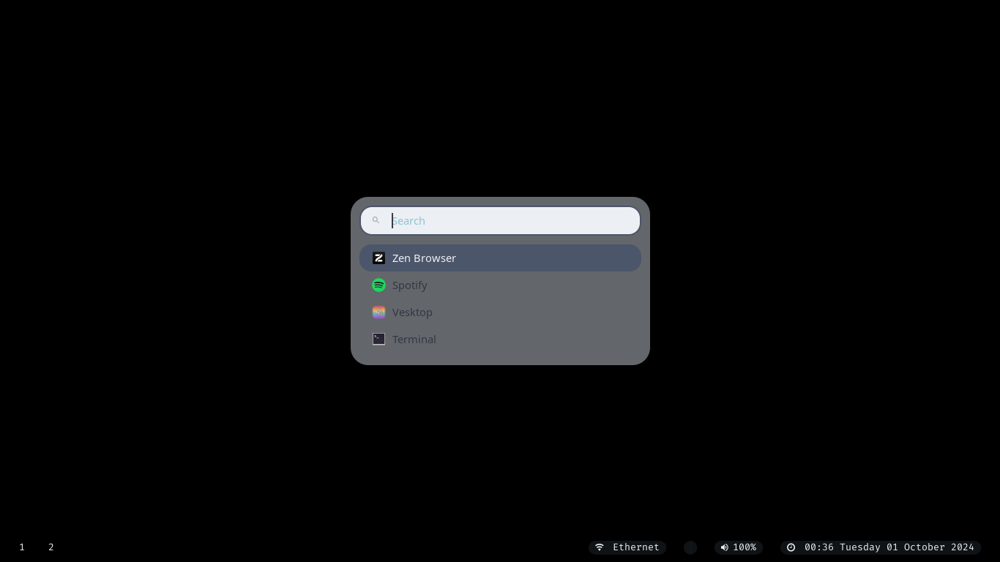

<h1 align="center">Personal Rofi Configuration</h1>

Welcome to the configuration hub for my Rofi setup! This directory holds all the details about the themes, scripts, and personal tweaks that make my Rofi setup unique. If you're looking to customize your own setup or are just curious about my configuration, you're in the right place.

## Table of Contents
- [Installation](#installation)
- [Configuration](#configuration)
- [Themes](#themes)
- [Screenshots](#screenshots)

## Installation

To install my Rofi configuration, simply clone my dotfiles repository and copy the Rofi configuration files to your Rofi config directory:

```bash
git clone https://github.com/stellaOnEstrogen/dotfiles.git
cp -r dotfiles/machines/personal/applications/rofi ~/.config/rofi
```

## Configuration

The main configuration file is `config.rasi`, which includes settings for display, fonts, and modules. You can customize it to fit your needs.

## Themes

Here's a list of some themes I use in my Rofi setup:

- `theme.rasi` for the main theme
- `rounded-common.rasi` for rounded corners and common styles

For a full list of themes and their configurations, refer to the [themes directory](./themes).

## Screenshots

Here’s a peek at my setup:

